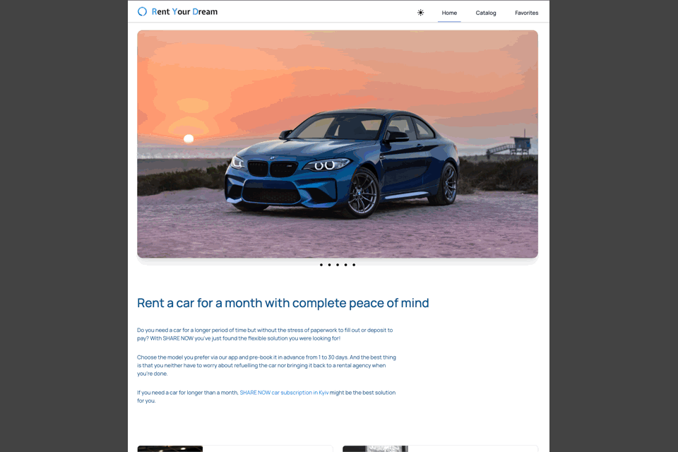

# Rent Your Dream

RentYourDream is a website for finding your dream car. If you've found a car you
like on our site or you're on a business trip, you can rent it through our
website at any time.

## Technologies used:

 Template Vite + React

| Frontend           | Backend |
| ------------------ | ------- |
| HTML/CSS           | MockAPI |
| JavaScript         |         |
| React              |         |
| Tailwind           |         |
| Pagination         |         |
| Axios              |         |
| React Router Dom   |         |
| React Select       |         |
| React Lazy Routing |         |
| Redux              |         |
| Persist            |         |
|                    |         |
|                    |         |
|                    |         |

## Description:

Welcome to our car rental platform, where your dream ride awaits! Browse through
our extensive catalog of vehicles, meticulously categorized for your
convenience. Whether you seek a specific make or have a budget in mind, our
advanced filtering options allow you to refine your search effortlessly.

Easily connect with our team to inquire about your chosen vehicle or any other
queries. Save your favorite cars for future reference and revisit them when you
have more time. Dive into detailed descriptions of each car, uncovering its
unique features, specifications, and more.

At RentYourDream, we're not just a rental service; we're your gateway to a
seamless, personalized car rental experience.

## Project deployed on:

The frontend is deployed on Netlify server.
